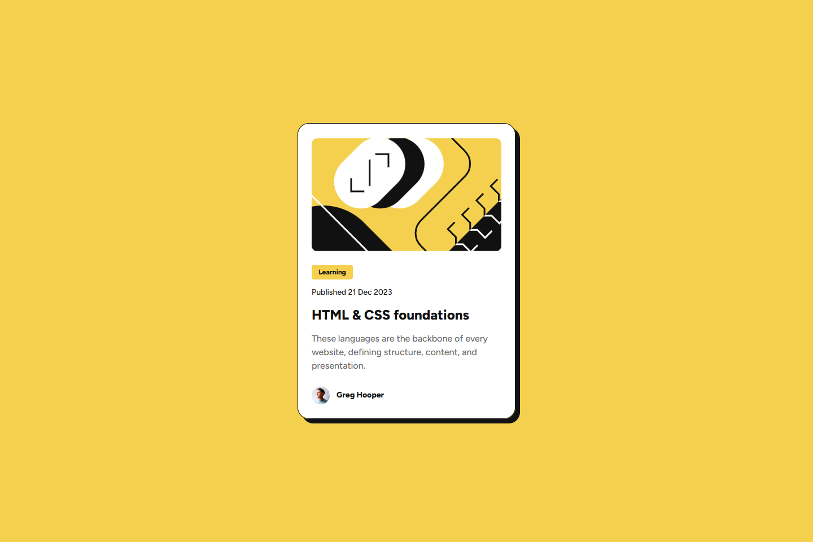

# Frontend Mentor - Blog preview card solution

This is a solution to the [Blog preview card component challenge on Frontend Mentor](https://www.frontendmentor.io/challenges/blog-preview-card-ckPaj01IcS). Frontend Mentor challenges help you improve your coding skills by building realistic projects.

## Table of contents

- [Overview](#overview)
  - [Screenshot](#screenshot)
  - [Links](#links)
- [My process](#my-process)
  - [Built with](#built-with)
  - [What I learned](#what-i-learned)
  - [Continued development](#continued-development)
  - [Useful resources](#useful-resources)
- [Author](#author)

---

## Overview

### Screenshot



### Links

- Live Site URL: [https://fem-blog-card.vercel.app/]

---

## My process

### Built with

- Semantic HTML5 markup
- CSS custom properties
- Flexbox
- Mobile-first workflow
- Responsive design with media queries
- BEM (Block Element Modifier) methodology

---

### What I learned

While working on this project, I improved my understanding of responsive design and CSS layout techniques. Here are some key takeaways:

1. **Flexbox for Layouts**  
   I used Flexbox to create a responsive layout for the blog card. This allowed me to center elements both horizontally and vertically:

   ```
   body {
       display: flex;
       justify-content: center;
       align-items: center;
       height: 100vh;
   }
   ```

2. **CSS Custom Properties**  
   I implemented CSS variables for colors, font sizes, and spacing, making the code more maintainable:

   ```
   :root {
       --yellow: hsl(47, 88%, 63%);
       --gray-500: hsl(0, 0%, 42%);
       --spacing-300: 24px;
   }
   ```

3. **BEM Naming Convention**  
   Following the BEM methodology helped me organize my CSS classes effectively:

   ```
   <div class="blog-card__author">
       
       <p class="blog-card__author-name">Greg Hooper</p>
   </div>
   ```

4. **Responsive Design**  
   I used media queries to adjust the layout for different screen sizes:
   ```
   @media (min-width: 1440px) {
       .blog-card {
           width: 384px;
           height: auto;
       }
   }
   ```

---

### Continued development

In future projects, I want to focus on:

1. Improving accessibility by adding ARIA roles and testing with screen readers.
2. Using CSS Grid for more complex layouts.
3. Enhancing hover and focus states for better interactivity.
4. Exploring advanced responsive techniques like `clamp()` for fluid typography.

---

### Useful resources

1. [CSS-Tricks Guide to Flexbox](https://css-tricks.com/snippets/css/a-guide-to-flexbox/) - Helped me understand how to align items in the blog card layout.
2. [MDN Web Docs on Media Queries](https://developer.mozilla.org/en-US/docs/Web/CSS/Media_Queries/Using_media_queries) - A great reference for writing responsive styles.
3. [Frontend Mentor Community Solutions](https://www.frontendmentor.io/solutions) - Browsing other solutions inspired me to improve my approach.

---

## Author

- Frontend Mentor - [@yourusername](https://www.frontendmentor.io/profile/Saran-Sandeep)
- GitHub - [@yourusername](https://github.com/Saran-Sandeep)

---

## Acknowledgments

I’d like to thank the Frontend Mentor community for providing feedback on my previous projects, which helped me improve this solution.
